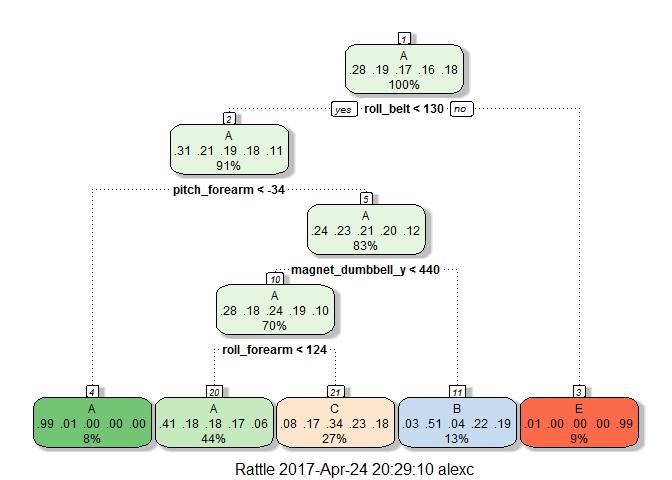

# Prediction Assignment Writeup


## Introduction

Using devices such as Jawbone Up, Nike FuelBand, and Fitbit it is now possible to collect a large amount of data about personal activity relatively inexpensively. These type of devices are part of the quantified self movement - a group of enthusiasts who take measurements about themselves regularly to improve their health, to find patterns in their behavior, or because they are tech geeks. One thing that people regularly do is quantify how much of a particular activity they do, but they rarely quantify how well they do it. In this project, your goal will be to use data from accelerometers on the belt, forearm, arm, and dumbell of 6 participants. They were asked to perform barbell lifts correctly and incorrectly in 5 different ways.  
  
The goal of the project is to predict the manner in which they did the exercise. This is the "classe" variable in the training set. Use any of the other variables to predict with.   

## Preparing Data
### Loading libraries

```r
library(caret)
library(rpart)
library(rpart.plot)
library(RColorBrewer)
library(rattle)
library(randomForest)
library(ggplot2)
```

### Loading data

```r
if (!file.exists("pml-training.csv")){
        download.file("http://d396qusza40orc.cloudfront.net/predmachlearn/pml-training.csv", destfile = "pml-training.csv")
}
if (!file.exists("pml-testing.csv")){
    download.file("http://d396qusza40orc.cloudfront.net/predmachlearn/pml-testing.csv", destfile = "pml-testing.csv")
}

training <- read.csv("pml-training.csv", na.strings = c("NA", "#DIV/0!", ""))
testing <- read.csv("pml-testing.csv", na.strings = c("NA", "#DIV/0!", ""))
dim(training); dim(testing)
```

```
## [1] 19622   160
```

```
## [1]  20 160
```
  
### Cleaning data
Removed the columns with NA

```r
training <- training[, colSums(is.na(training)) == 0]
testing <- testing[, colSums(is.na(testing)) == 0]
dim(training); dim(testing)
```

```
## [1] 19622    60
```

```
## [1] 20 60
```
  
Remove unrelevant variables

```r
training <- training[, -c(1:7)]
testing <- testing[, -c(1:7)]
dim(training); dim(testing)
```

```
## [1] 19622    53
```

```
## [1] 20 53
```
### Data Partitioning

```r
inTrain <- createDataPartition(training$classe, p=0.70, list=F)
train_data <- training[inTrain, ]
test_data <- training[-inTrain, ]
```

## Modelling and Prediction
  
### Tree Method

```r
modfit1 <- train(classe ~ .,method='rpart',data=train_data)
fancyRpartPlot(modfit1$finalModel) 
```

<!-- -->

```r
predictions <- predict(modfit1, newdata = test_data)
confusionMatrix(predictions, test_data$classe)
```

```
## Confusion Matrix and Statistics
## 
##           Reference
## Prediction    A    B    C    D    E
##          A 1526  462  494  443  170
##          B   29  382   33  170  144
##          C  111  295  499  351  310
##          D    0    0    0    0    0
##          E    8    0    0    0  458
## 
## Overall Statistics
##                                          
##                Accuracy : 0.4868         
##                  95% CI : (0.474, 0.4997)
##     No Information Rate : 0.2845         
##     P-Value [Acc > NIR] : < 2.2e-16      
##                                          
##                   Kappa : 0.3288         
##  Mcnemar's Test P-Value : NA             
## 
## Statistics by Class:
## 
##                      Class: A Class: B Class: C Class: D Class: E
## Sensitivity            0.9116  0.33538  0.48635   0.0000  0.42329
## Specificity            0.6274  0.92078  0.78041   1.0000  0.99833
## Pos Pred Value         0.4931  0.50396  0.31865      NaN  0.98283
## Neg Pred Value         0.9470  0.85235  0.87798   0.8362  0.88485
## Prevalence             0.2845  0.19354  0.17434   0.1638  0.18386
## Detection Rate         0.2593  0.06491  0.08479   0.0000  0.07782
## Detection Prevalence   0.5259  0.12880  0.26610   0.0000  0.07918
## Balanced Accuracy      0.7695  0.62808  0.63338   0.5000  0.71081
```

  
### Random Forest

```r
modfit2 <- randomForest(classe~.,data=training,ntree=100)
modfit2
```

```
## 
## Call:
##  randomForest(formula = classe ~ ., data = training, ntree = 100) 
##                Type of random forest: classification
##                      Number of trees: 100
## No. of variables tried at each split: 7
## 
##         OOB estimate of  error rate: 0.36%
## Confusion matrix:
##      A    B    C    D    E  class.error
## A 5576    3    0    0    1 0.0007168459
## B    7 3782    8    0    0 0.0039504872
## C    0   12 3407    3    0 0.0043834015
## D    0    0   26 3189    1 0.0083955224
## E    0    0    1    8 3598 0.0024951483
```

```r
predictions <- predict(modfit2, newdata=test_data)
confusionMatrix(predictions, test_data$classe)
```

```
## Confusion Matrix and Statistics
## 
##           Reference
## Prediction    A    B    C    D    E
##          A 1674    0    0    0    0
##          B    0 1139    0    0    0
##          C    0    0 1026    0    0
##          D    0    0    0  964    0
##          E    0    0    0    0 1082
## 
## Overall Statistics
##                                      
##                Accuracy : 1          
##                  95% CI : (0.9994, 1)
##     No Information Rate : 0.2845     
##     P-Value [Acc > NIR] : < 2.2e-16  
##                                      
##                   Kappa : 1          
##  Mcnemar's Test P-Value : NA         
## 
## Statistics by Class:
## 
##                      Class: A Class: B Class: C Class: D Class: E
## Sensitivity            1.0000   1.0000   1.0000   1.0000   1.0000
## Specificity            1.0000   1.0000   1.0000   1.0000   1.0000
## Pos Pred Value         1.0000   1.0000   1.0000   1.0000   1.0000
## Neg Pred Value         1.0000   1.0000   1.0000   1.0000   1.0000
## Prevalence             0.2845   0.1935   0.1743   0.1638   0.1839
## Detection Rate         0.2845   0.1935   0.1743   0.1638   0.1839
## Detection Prevalence   0.2845   0.1935   0.1743   0.1638   0.1839
## Balanced Accuracy      1.0000   1.0000   1.0000   1.0000   1.0000
```
  
## Conclusion
Random Forest model has a much higher accuracy than Decision Tree
It can be used to predict the testing data

```r
answers <- predict(modfit2, testing)
answers
```

```
##  1  2  3  4  5  6  7  8  9 10 11 12 13 14 15 16 17 18 19 20 
##  B  A  B  A  A  E  D  B  A  A  B  C  B  A  E  E  A  B  B  B 
## Levels: A B C D E
```
